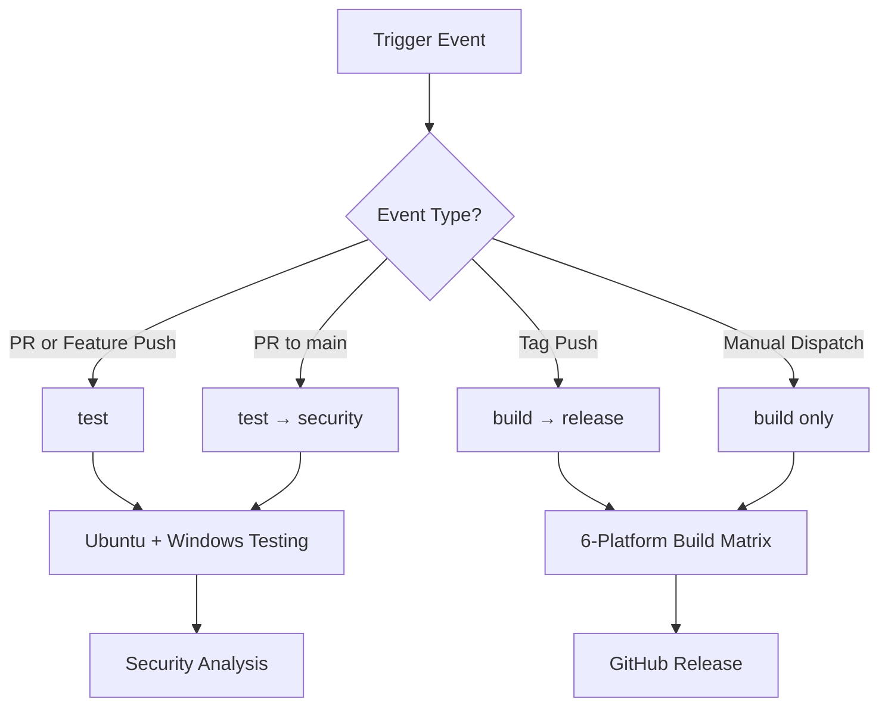

# CI/CD Pipeline Architecture

## Overview

ZTiAWS uses a consolidated, intelligent CI/CD pipeline designed for efficient development workflows and reliable releases. The pipeline automatically adapts its behavior based on the type of change, providing fast feedback for development and comprehensive validation for releases.

## Design Philosophy

### **Smart Conditional Execution**
Jobs run only when needed, optimizing CI/CD resource usage and developer experience:
- **Quick feedback** for feature development
- **Comprehensive validation** for production releases
- **Security scanning** for critical changes
- **Cross-platform builds** only when necessary

### **DRY (Don't Repeat Yourself) Principles**
- **Single workflow file** instead of multiple redundant workflows
- **Conditional jobs** that adapt to different scenarios
- **Shared setup steps** with consistent Go version and dependencies
- **Consolidated security tooling** avoiding duplicate vulnerability scans

## Pipeline Architecture

### Workflow: `.github/workflows/build.yml`

#### **Triggers**
```yaml
on:
  push:
    branches: [ main, 'feature/*', 'feat/*', 'issue/*' ]
    tags: [ 'v*' ]
    paths: [ 'ztictl/**' ]
  pull_request:
    branches: [ main ]
    paths: [ 'ztictl/**' ]
  workflow_dispatch:
```

**Why this design:**
- **Path filtering** (`ztictl/**`) ensures pipeline runs only for relevant changes
- **Branch patterns** support standard Git flow (feature branches, main)
- **Tag-based releases** enable automated release creation
- **Manual dispatch** allows on-demand builds

#### **Job Architecture**



### **Job Details**

#### 1. **test** - Test & Validate
```yaml
if: github.event_name == 'pull_request' || (github.event_name == 'push' && !startsWith(github.ref, 'refs/tags/'))
strategy:
  matrix:
    os: [ubuntu-latest, windows-latest]
```

**Purpose:** Provide rapid feedback during development
**When it runs:** All PRs and feature branch pushes (not tags)
**What it does:**
- Unit tests (`go test -v ./...`)
- Static analysis (`go vet`)
- Code formatting validation (`gofmt`)
- Build verification
- CLI functionality testing

**Why Ubuntu + Windows:**
- Covers majority of development environments
- Tests cross-platform compatibility early
- Faster than full 6-platform matrix
- Sufficient for development validation

#### 2. **security** - Security Analysis
```yaml
if: github.event_name == 'pull_request' && github.base_ref == 'main'
needs: test
```

**Purpose:** Security validation for main branch changes
**When it runs:** Only PRs targeting main branch, after tests pass
**Dependencies:** Requires `test` job to complete successfully
**Tools used:**
- **Trivy**: Comprehensive vulnerability scanner (filesystem, dependencies)
- **GoSec**: Go-specific security analysis (injection, crypto issues) via official GitHub Action
- **govulncheck**: Official Go vulnerability database
- **Dependency updates**: Check for outdated packages

**Why this conditional approach:**
- Security scans are resource-intensive
- Main branch PRs need highest security validation
- Feature branch work doesn't require full security scan
- Prevents CI/CD bottlenecks during development
- **Fail fast**: Only runs if tests pass

**Security Tools Rationale:**
- **Trivy vs Nancy**: Removed Nancy (redundant with Trivy's capabilities)
- **GoSec**: Uses official GitHub Action `securego/gosec@master`
- **Non-blocking**: All security scans use `continue-on-error: true` for informational purposes

#### 3. **build** - Cross-Platform Build
```yaml
if: startsWith(github.ref, 'refs/tags/') || github.event_name == 'workflow_dispatch'
strategy:
  matrix:
    include:
      - goos: linux, goarch: amd64
      - goos: linux, goarch: arm64
      - goos: darwin, goarch: amd64    # Intel Mac
      - goos: darwin, goarch: arm64    # Apple Silicon
      - goos: windows, goarch: amd64
      - goos: windows, goarch: arm64
```

**Purpose:** Create production-ready binaries for all supported platforms
**When it runs:** Version tags or manual dispatch only
**Features:**
- Version injection from Git tags
- Optimized builds (`-ldflags "-s -w"`)
- Binary verification (Linux AMD64)
- Artifact upload with 30-day retention

**Why 6 platforms:**
- Comprehensive platform support for end users
- ARM64 support for modern hardware (Apple Silicon, ARM servers)
- Future-proofing for emerging architectures

#### 4. **release** - GitHub Release
```yaml
if: startsWith(github.ref, 'refs/tags/v')
needs: [build]
```

**Purpose:** Automated GitHub release creation
**When it runs:** Only version tags (e.g., `v1.2.0`)
**Dependencies:** Requires `build` job to complete successfully
**Process:**
1. Download all build artifacts
2. Create platform-specific archives (tar.gz for Unix, zip for Windows)
3. Create GitHub release with auto-generated release notes
4. Attach all binaries to release

## Workflow Behavior Matrix

| Scenario | Triggered Jobs | Execution Order |
|----------|---------------|-----------------|
| **Feature branch push** | `test` | Parallel (Ubuntu + Windows) |
| **PR to feature branch** | `test` | Parallel (Ubuntu + Windows) |
| **PR to main branch** | `test` → `security` | Sequential (fail fast) |
| **Tag push (v1.0.0)** | `build` → `release` | Sequential |
| **Manual dispatch** | `build` | Single job matrix |

## Performance Optimizations

### **Fail Fast Strategy**
- **Tests fail** → Security scans are skipped automatically
- **Build fails** → Release is skipped automatically
- **Early feedback** → Developers get test results first
- **Resource savings** → Expensive jobs only run when prerequisites pass

### **Resource Efficiency**
- **Conditional execution**: Jobs run only when needed
- **Path filtering**: Skip irrelevant changes
- **Matrix optimization**: Tests use 2 platforms, builds use 6
- **Smart dependencies**: Security analysis only after successful tests

### **Developer Experience**
- **Fast feedback loop**: Quick tests complete in ~3-5 minutes
- **Non-blocking security**: Information-only security scans
- **Clear status reporting**: Descriptive job names and summaries

### **CI/CD Cost Optimization**
- **Smart triggering**: Expensive builds only for releases
- **Artifact retention**: 30-day cleanup prevents storage bloat
- **Efficient caching**: Go module caching via actions/setup-go

## Migration from Legacy Workflows

### **Consolidated from Multiple Files**
Previously had separate workflows:
- `build.yml` - Release builds
- `go-test.yml` - Development testing
- `test.yml` - Legacy testing
- `release.yml` - Release management

### **Benefits of Consolidation**
- **Single source of truth** for CI/CD logic
- **Reduced maintenance overhead** 
- **Consistent Go version** across all jobs
- **Eliminated redundant testing**
- **Clearer job relationships**

## Security Considerations

### **SAST (Static Application Security Testing)**
- **Non-failing approach**: Security issues reported but don't block development
- **Comprehensive coverage**: Multiple tools for different vulnerability types
- **Dependency tracking**: Automated alerts for outdated packages

### **Build Security**
- **Pinned action versions**: `@v4` for stability and security
- **Minimal permissions**: Jobs use least-privilege access
- **Artifact signing**: Future consideration for binary integrity

## Maintenance

### **Regular Updates**
- **Go version**: Update in single location for all jobs
- **Action versions**: Periodic updates for security and features
- **Security tools**: Keep SAST tools current

### **Monitoring**
- **Build status badges**: Visible in README
- **Failed build notifications**: GitHub notifications
- **Performance tracking**: Monitor CI/CD execution times

## Future Enhancements

### **Planned Improvements**
- **Caching optimization**: More aggressive Go module and build caching
- **Test parallelization**: Parallel test execution for large test suites
- **Integration testing**: AWS integration tests in isolated environments
- **Binary signing**: Code signing for enhanced security

### **Scalability Considerations**
- **Self-hosted runners**: For faster builds if needed
- **Matrix optimization**: Dynamic platform selection based on changes
- **Artifact distribution**: CDN distribution for popular releases

---

## Quick Reference

**Key Files:**
- Primary workflow: `.github/workflows/build.yml`
- Build configuration: `ztictl/Makefile`
- Dependencies: `ztictl/go.mod`

**Common Commands:**
```bash
# Trigger test validation
git push origin feature/my-change

# Trigger comprehensive validation (test + security)
gh pr create --base main

# Trigger production release
git tag v1.1.0 && git push origin v1.1.0

# Manual cross-platform build
gh workflow run build.yml
```
