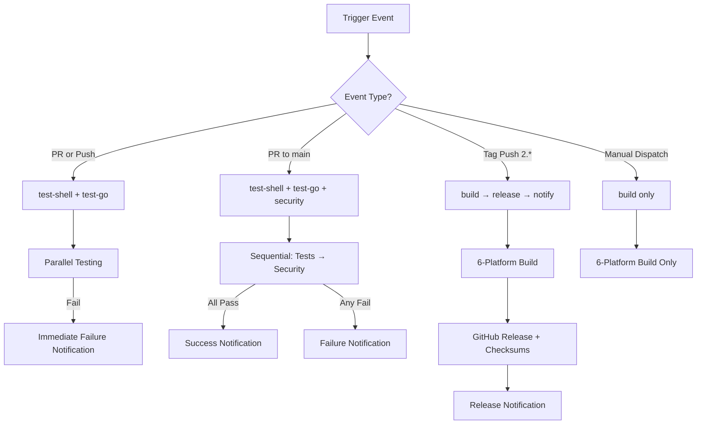

# CI/CD Pipeline Architecture

## Overview

ZTiAWS uses a streamlined, intelligent CI/CD pipeline with two optimized workflows designed for efficient development and reliable releases. The pipeline automatically adapts its behavior based on the type of change, providing fast feedback for development and comprehensive validation for releases.

## Design Philosophy

### **Smart Conditional Execution**

Jobs run only when needed, optimizing CI/CD resource usage and developer experience:

- **Quick feedback** for feature development
- **Comprehensive validation** for production releases
- **Security scanning** for critical changes
- **Cross-platform builds** only when necessary

### **DRY (Don't Repeat Yourself) Principles**

- **Single workflow file** instead of multiple redundant workflows
- **Conditional jobs** that adapt to different scenarios
- **Shared setup steps** with consistent Go version and dependencies
- **Consolidated security tooling** avoiding duplicate vulnerability scans

## Pipeline Architecture

The ZTiAWS CI/CD pipeline consists of two specialized workflows:

### Primary Workflow: `.github/workflows/build.yml` (Unified CI/CD)

**Focus**: Complete testing, security, and release pipeline for all components

#### **Triggers**

```yaml
on:
  push:
    branches: [main, 'feature/*', 'feat/*', 'issue/*', 'release/*']
    tags: ['v*']
    paths:
      [
        'ztictl/**',
        'authaws',
        'ssm',
        'src/**',
        'tools/**',
        '01_install.sh',
        '02_uninstall.sh',
        'go.mod',
        'go.sum',
        'Makefile',
      ]
  pull_request:
    branches: [main, 'release/*']
    paths: [/* same as above */]
  workflow_dispatch:
```

**Why this unified design:**

- **Comprehensive path filtering** covers all project components
- **Single workflow** eliminates duplicate testing overhead
- **Branch patterns** support complete Git flow
- **Tag-based releases** enable automated release creation
- **Dependency awareness** (go.mod, Makefile changes trigger rebuilds)

#### Job Architecture



### **Job Details**

#### 1. **test-shell** - Shell Script Validation

```yaml
if: github.event_name == 'pull_request' || (github.event_name == 'push' && !startsWith(github.ref, 'refs/tags/'))
strategy:
  matrix:
    os: [ubuntu-latest, macos-latest]
```

**Purpose:** Validate shell scripts on Unix-like systems
**When it runs:** All PRs and feature branch pushes (not tags)
**What it does:**

- ShellCheck static analysis (`shellcheck -x`)
- Syntax validation (`bash -n`)
- Cross-platform compatibility testing

**Why Ubuntu + macOS:**

- Primary shell script platforms (bash/zsh)
- Windows users utilize ztictl.exe (Go binary)
- Covers 95% of shell script usage scenarios

#### 2. **test-go** - Go Code Testing

```yaml
if: github.event_name == 'pull_request' || (github.event_name == 'push' && !startsWith(github.ref, 'refs/tags/'))
strategy:
  matrix:
    os: [ubuntu-latest, windows-latest, macos-latest]
```

**Purpose:** Comprehensive Go code testing and validation
**When it runs:** All PRs and feature branch pushes (not tags)
**What it does:**

- Unit tests (`go test -v ./...`)
- Static analysis (`go vet ./...`)
- Code formatting validation (`gofmt -s -l .`)
- Build verification for each platform
- CLI command testing (help, version, config commands)

**Why 3 platforms:**

- Full cross-platform validation (Linux, Windows, macOS)
- Platform-specific path handling verification
- Line ending compatibility checks (CRLF vs LF)

#### 3. **security** - Security Analysis

```yaml
if: github.event_name == 'pull_request' && github.base_ref == 'main'
needs: [test-shell, test-go]
```

**Purpose:** Security validation for main branch changes
**When it runs:** Only PRs targeting main branch, after all tests pass
**Dependencies:** Requires both `test-shell` and `test-go` jobs to complete successfully
**Skip Behavior:** Automatically skipped if prerequisite tests fail (prevents blocking PR notifications)
**Tools used:**

- **Trivy**: Filesystem vulnerability scanning by Aqua Security
- **golangci-lint v1.61.0**: With GoSec security linters enabled
- **Standalone GoSec**: Backup security analysis (latest version)
- **govulncheck**: Official Go vulnerability database checker
- **Dependency audit**: Lists outdated packages with `go list -u -m all`

**Why this conditional approach:**

- Security scans are resource-intensive
- Main branch PRs need highest security validation
- Feature branch work doesn't require full security scan
- Prevents CI/CD bottlenecks during development
- **Fail fast**: Only runs if tests pass

**Security Tools Configuration:**

- **Non-blocking design**: All scans use `continue-on-error: true`
- **Layered approach**: Multiple tools for comprehensive coverage
- **Report artifacts**: JSON reports uploaded for 30-day retention
- **Informational only**: Security findings don't block PRs (by design)

#### 4. **build** - Cross-Platform Build

```yaml
if: startsWith(github.ref, 'refs/tags/') || github.event_name == 'workflow_dispatch'
strategy:
  matrix:
    include:
      - goos: linux, goarch: amd64
      - goos: linux, goarch: arm64
      - goos: darwin, goarch: amd64    # Intel Mac
      - goos: darwin, goarch: arm64    # Apple Silicon
      - goos: windows, goarch: amd64
      - goos: windows, goarch: arm64
```

**Purpose:** Create production-ready binaries for all supported platforms
**When it runs:** Version tags or manual dispatch only
**Features:**

- Version injection: `${VERSION}` from git tag or `dev-${COMMIT_SHA}`
- Optimized builds: `-ldflags "-X main.Version=${VERSION} -s -w"`
- Binary verification: Test run on Linux AMD64 only
- Artifact upload: Individual platform artifacts with 30-day retention

**Why 6 platforms:**

- Comprehensive platform support for end users
- ARM64 support for modern hardware (Apple Silicon, ARM servers)
- Future-proofing for emerging architectures

#### 5. **release** - GitHub Release

```yaml
if: startsWith(github.ref, 'refs/tags/v')
needs: [build]
```

**Purpose:** Automated GitHub release creation
**When it runs:** Only version tags (e.g., `v1.2.0`)
**Dependencies:** Requires `build` job to complete successfully
**Process:**

1. Download all build artifacts from matrix jobs
2. Create direct binary downloads (users expect this)
3. Also create archives: tar.gz for Unix, zip for Windows
4. Use RELEASE_NOTES.md for release body
5. Create non-draft, non-prerelease GitHub release
6. Attach both direct binaries and archives

#### 5. **Embedded Notifications** - PR Status Reporting

**Architecture:** Notification steps embedded within each critical job

**Implementation Pattern:**

```yaml
- name: Notify on Test Failure
  if: failure() && matrix.os == 'ubuntu-latest' && github.event_name == 'pull_request'
```

**Purpose:** Immediate notification when any critical step fails or succeeds
**When it runs:** Embedded in each job - triggers based on that job's result
**No Dependencies:** Each job can notify independently, preventing cascade failures

**Notification Points:**

- **Shell Test Job**: Notifies immediately on shell test failure
- **Go Test Job**: Notifies immediately on Go test failure
- **Security Job**: Notifies on security failure OR final success (all tests passed)

**Message Types:**

- **Individual failures**: "❌ [Shell/Go/Security] tests failed - PR needs attention"
- **Final success**: "✅ All tests passed - PR is ready for review"
- **Immediate feedback**: No waiting for other jobs to complete

**Benefits:**

- **Fail-fast notifications**: Immediate alerts when issues occur
- **No dependency chains**: Each job notifies independently
- **Guaranteed delivery**: Cannot be blocked by other job failures
- **Single runner**: Only Ubuntu runners send notifications (prevents duplicates)

#### 6. **release-notification** - Release Notifications

```yaml
if: startsWith(github.ref, 'refs/tags/v')
needs: [release]
```

**Purpose:** Notify team of new releases available
**When it runs:** Version tags pushed, after GitHub release is created
**Dependencies:** Requires `release` job to complete successfully
**Integration:** Uses same Google Chat webhook as zsoftly-services repository
**Script used:** `scripts/send-release-notification.sh`
**Message includes:** Version number, GitHub release URL, repository name
**Error handling:** Uses `set -euo pipefail` for robust execution

## Workflow Behavior Matrix

| Scenario                | Triggered Jobs                        | Execution & Notifications                         |
| ----------------------- | ------------------------------------- | ------------------------------------------------- |
| **Feature branch push** | `test-shell` + `test-go`              | Parallel execution, no notifications              |
| **PR to any branch**    | `test-shell` + `test-go`              | Parallel, failure notifications to Google Chat    |
| **PR to main (pass)**   | `test-shell` + `test-go` → `security` | Sequential, success notification after security   |
| **PR to main (fail)**   | `test-shell` + `test-go`              | Tests run, security skipped, failure notification |
| **Release branch push** | `auto-generate-docs`                  | Generates and commits CHANGELOG.md                |
| **Tag push (v\*)**      | `build` → `release` → `notification`  | Full release pipeline                             |
| **Manual dispatch**     | `build` only                          | Cross-platform builds without release             |

## Performance Optimizations

### **Fail Fast Strategy**

- **Tests fail** → Security scans are skipped automatically
- **Build fails** → Release is skipped automatically
- **Early feedback** → Developers get test results first
- **Resource savings** → Expensive jobs only run when prerequisites pass
- **Immediate notifications** → Each job notifies on failure, no waiting for dependent jobs

### **Resource Efficiency**

- **Conditional execution**: Jobs run only when needed
- **Path filtering**: Skip irrelevant changes
- **Matrix optimization**: Tests use 2 platforms, builds use 6
- **Smart dependencies**: Security analysis only after successful tests

### **Developer Experience**

- **Fast feedback loop**: Quick tests complete in ~3-5 minutes
- **Non-blocking security**: Information-only security scans
- **Clear status reporting**: Descriptive job names and summaries
- **Immediate failure alerts**: Instant notifications when any test fails
- **No cascade delays**: Notifications sent immediately, not after all jobs complete
- **Single final success**: Only one success notification after all tests pass

### **CI/CD Cost Optimization**

- **Smart triggering**: Expensive builds only for releases
- **Artifact retention**: 30-day cleanup prevents storage bloat
- **Efficient caching**: Go module caching via actions/setup-go

## Release Process Integration

### **Git Flow with Automation**

The CI/CD pipeline integrates with the release process defined in [RELEASE.md](development/RELEASE.md):

1. **Create release branch**: `git checkout -b release/v2.7.0`
2. **Push triggers docs generation**: Auto-generates CHANGELOG.md via workflow
3. **Pull generated docs**: `git pull origin release/v2.7.0`
4. **Tag triggers build**: `git tag v2.7.0 && git push origin v2.7.0`
5. **Automated release**: Build → GitHub Release → Notification
6. **Merge back**: Complete Git flow by merging to main

### **Automation Benefits**

- **Zero manual changelog editing**: Git history drives documentation
- **Consistent versioning**: Branch names control versions
- **Fail-safe process**: Each step validates before proceeding
- **Audit trail**: All changes tracked in git

### **Benefits of Consolidation**

- **Single source of truth** for CI/CD logic
- **Reduced maintenance overhead**
- **Consistent Go version** across all jobs
- **Eliminated redundant testing**
- **Clearer job relationships**

## Security Considerations

### **SAST (Static Application Security Testing)**

- **Non-failing approach**: Security issues reported but don't block development
- **Comprehensive coverage**: Multiple tools for different vulnerability types
- **Dependency tracking**: Automated alerts for outdated packages

### **Build Security**

- **Pinned action versions**: `@v4` for stability and security
- **Minimal permissions**: Jobs use least-privilege access
- **Artifact signing**: Future consideration for binary integrity

## Maintenance

### **Regular Updates**

- **Go version**: Currently **1.24** (intentionally, see note below)
- **Action versions**: Using v4 for checkout, v5 for setup-go
- **Security tools**: golangci-lint pinned at v1.61.0 for stability
- **Build dependencies**: Regular `go mod tidy` and updates

> **Note:** Keep these values in sync with `.github/workflows/build.yml`

### **Go Version Policy**

As of December 2025, Go 1.25.5 is the latest stable release. This project **intentionally stays on Go 1.24.x** for the following reasons:

- **Stability**: Go 1.24 is battle-tested and well-supported
- **Compatibility**: Ensures broader compatibility with user environments
- **AWS SDK**: Validated against AWS SDK v2 on Go 1.24
- **Conservative approach**: Upgrade after Go 1.25 has more production exposure

**Upgrade plan**: Evaluate Go 1.25 upgrade when Go 1.26 is released (expected Feb 2026), ensuring one major version buffer for stability.

### **Monitoring**

- **Build status badges**: Visible in README
- **Failed build notifications**: GitHub notifications
- **Performance tracking**: Monitor CI/CD execution times

## Future Enhancements

### **Potential Improvements**

- **Go version**: Upgrade to Go 1.25+ when stable (see Go Version Policy above)
- **golangci-lint**: Update from v1.61.0 to latest stable (sync with Maintenance section)
- **Test coverage**: Add coverage reporting and badges
- **AWS integration tests**: Mock AWS services for deeper testing
- **Binary signing**: GPG signing for release artifacts

### **Scalability Considerations**

- **Self-hosted runners**: For faster builds if needed
- **Matrix optimization**: Dynamic platform selection based on changes
- **Artifact distribution**: CDN distribution for popular releases

---

## Quick Reference

**Key Files:**

- Main pipeline: `.github/workflows/build.yml`
- Documentation: `.github/workflows/auto-generate-docs.yml`
- Release process: `docs/development/RELEASE.md`
- Build config: `ztictl/Makefile`
- Dependencies: `ztictl/go.mod`, `ztictl/go.sum`
- Notification scripts: `scripts/send-*.sh`

**Common Commands:**

```bash
# Trigger test validation
git push origin feature/my-change

# Trigger comprehensive validation (test + security)
gh pr create --base main

# Trigger documentation generation
git checkout -b release/v2.7.0 && git push -u origin release/v2.7.0

# Trigger production release (after docs generated)
git tag v2.7.0 && git push origin v2.7.0

# Manual cross-platform build
gh workflow run build.yml

# View workflow runs
gh run list --workflow=build.yml
```
