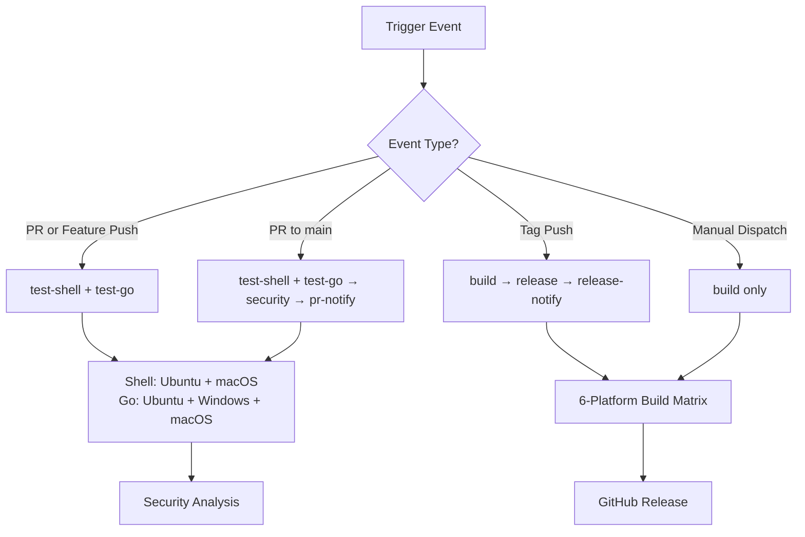

# CI/CD Pipeline Architecture

## Overview

ZTiAWS uses a streamlined, intelligent CI/CD pipeline with two optimized workflows designed for efficient development and reliable releases. The pipeline automatically adapts its behavior based on the type of change, providing fast feedback for development and comprehensive validation for releases.

## Design Philosophy

### **Smart Conditional Execution**
Jobs run only when needed, optimizing CI/CD resource usage and developer experience:
- **Quick feedback** for feature development
- **Comprehensive validation** for production releases
- **Security scanning** for critical changes
- **Cross-platform builds** only when necessary

### **DRY (Don't Repeat Yourself) Principles**
- **Single workflow file** instead of multiple redundant workflows
- **Conditional jobs** that adapt to different scenarios
- **Shared setup steps** with consistent Go version and dependencies
- **Consolidated security tooling** avoiding duplicate vulnerability scans

## Pipeline Architecture

The ZTiAWS CI/CD pipeline consists of two optimized workflows:

### Primary Workflow: `.github/workflows/build.yml` (Unified CI/CD)
**Focus**: Complete testing, security, and release pipeline for all components

#### **Triggers**
```yaml
on:
  push:
    branches: [ main, 'feature/*', 'feat/*', 'issue/*', 'release/*' ]
    tags: [ 'v*' ]
    paths: [ 
      'ztictl/**', 'authaws', 'ssm', 'src/**', 'tools/**', 
      'install.sh', 'uninstall.sh', 'go.mod', 'go.sum', 'Makefile'
    ]
  pull_request:
    branches: [ main, 'release/*' ]
    paths: [ /* same as above */ ]
  workflow_dispatch:
```

**Why this unified design:**
- **Comprehensive path filtering** covers all project components
- **Single workflow** eliminates duplicate testing overhead
- **Branch patterns** support complete Git flow
- **Tag-based releases** enable automated release creation
- **Dependency awareness** (go.mod, Makefile changes trigger rebuilds)

#### **Job Architecture**



### Documentation Workflow: `.github/workflows/auto-generate-docs.yml`
**Focus**: Automated release documentation generation

**Triggers**: Push to `release/*` branches  
**Purpose**: Generates CHANGELOG.md and RELEASE_NOTES.txt using tools/02_release_docs_generator.sh

### **Job Details**

#### 1. **test-shell** - Shell Script Validation
```yaml
if: github.event_name == 'pull_request' || (github.event_name == 'push' && !startsWith(github.ref, 'refs/tags/'))
strategy:
  matrix:
    os: [ubuntu-latest, macos-latest]
```

**Purpose:** Validate shell scripts on Unix-like systems
**When it runs:** All PRs and feature branch pushes (not tags)
**What it does:**
- ShellCheck static analysis (`shellcheck -x`)
- Syntax validation (`bash -n`)
- Cross-platform compatibility testing

**Why Ubuntu + macOS:**
- Covers primary shell script target platforms
- Windows shell script support not needed (ztictl handles Windows)

#### 2. **test-go** - Go Code Testing
```yaml
if: github.event_name == 'pull_request' || (github.event_name == 'push' && !startsWith(github.ref, 'refs/tags/'))
strategy:
  matrix:
    os: [ubuntu-latest, windows-latest, macos-latest]
```

**Purpose:** Comprehensive Go code testing and validation
**When it runs:** All PRs and feature branch pushes (not tags)
**What it does:**
- Unit tests with coverage (`go test -v -race -coverprofile=coverage.out`)
- Static analysis (`go vet`)
- Code formatting validation (`gofmt`)
- Build verification
- CLI functionality testing

**Why 3 platforms:**
- Full cross-platform compatibility validation
- Early detection of platform-specific issues
- Comprehensive testing before security analysis

#### 3. **security** - Security Analysis
```yaml
if: github.event_name == 'pull_request' && github.base_ref == 'main'
needs: [test-shell, test-go]
```

**Purpose:** Security validation for main branch changes
**When it runs:** Only PRs targeting main branch, after all tests pass
**Dependencies:** Requires both `test-shell` and `test-go` jobs to complete successfully
**Tools used:**
- **Trivy**: Comprehensive vulnerability scanner (filesystem, dependencies)
- **GoSec**: Go-specific security analysis (injection, crypto issues) via official GitHub Action
- **govulncheck**: Official Go vulnerability database
- **Dependency updates**: Check for outdated packages

**Why this conditional approach:**
- Security scans are resource-intensive
- Main branch PRs need highest security validation
- Feature branch work doesn't require full security scan
- Prevents CI/CD bottlenecks during development
- **Fail fast**: Only runs if tests pass

**Security Tools Rationale:**
- **Trivy vs Nancy**: Removed Nancy (redundant with Trivy's capabilities)
- **GoSec**: Uses official GitHub Action `securego/gosec@master`
- **Non-blocking**: All security scans use `continue-on-error: true` for informational purposes

#### 4. **build** - Cross-Platform Build
```yaml
if: startsWith(github.ref, 'refs/tags/') || github.event_name == 'workflow_dispatch'
strategy:
  matrix:
    include:
      - goos: linux, goarch: amd64
      - goos: linux, goarch: arm64
      - goos: darwin, goarch: amd64    # Intel Mac
      - goos: darwin, goarch: arm64    # Apple Silicon
      - goos: windows, goarch: amd64
      - goos: windows, goarch: arm64
```

**Purpose:** Create production-ready binaries for all supported platforms
**When it runs:** Version tags or manual dispatch only
**Features:**
- Version injection from Git tags
- Optimized builds (`-ldflags "-s -w"`)
- Binary verification (Linux AMD64)
- Artifact upload with 30-day retention

**Why 6 platforms:**
- Comprehensive platform support for end users
- ARM64 support for modern hardware (Apple Silicon, ARM servers)
- Future-proofing for emerging architectures

#### 5. **release** - GitHub Release
```yaml
if: startsWith(github.ref, 'refs/tags/v')
needs: [build]
```

**Purpose:** Automated GitHub release creation
**When it runs:** Only version tags (e.g., `v1.2.0`)
**Dependencies:** Requires `build` job to complete successfully
**Process:**
1. Download all build artifacts
2. Create platform-specific archives (tar.gz for Unix, zip for Windows)
3. Create GitHub release with auto-generated release notes
4. Attach all binaries to release

#### 6. **pr-notification** - PR Notifications
```yaml
if: github.event_name == 'pull_request' && github.event.action == 'opened' && github.base_ref == 'main'
needs: [test-shell, test-go, security]
```

**Purpose:** Notify team of new PRs opened to main branch
**When it runs:** PRs opened to main branch, after all tests and security scans pass
**Dependencies:** Requires `test-shell`, `test-go`, and `security` jobs to complete successfully
**Integration:** Uses same Google Chat webhook as zsoftly-services repository
**Message format:** Includes PR title, author, and direct link to PR

#### 7. **release-notification** - Release Notifications
```yaml
if: startsWith(github.ref, 'refs/tags/v')
needs: [release]
```

**Purpose:** Notify team of new releases available
**When it runs:** Version tags pushed, after GitHub release is created
**Dependencies:** Requires `release` job to complete successfully
**Integration:** Uses same Google Chat webhook as zsoftly-services repository
**Message format:** Includes version number, release URL, and deployment notice

## Workflow Behavior Matrix

| Scenario | Triggered Jobs | Execution Order |
|----------|---------------|-----------------|
| **Feature branch push** | `test-shell` + `test-go` | Parallel (Shell: Ubuntu+macOS, Go: Ubuntu+Windows+macOS) |
| **PR to feature branch** | `test-shell` + `test-go` | Parallel (Shell: Ubuntu+macOS, Go: Ubuntu+Windows+macOS) |
| **PR to main branch** | `test-shell` + `test-go` → `security` → `pr-notification` | Sequential (fail fast) |
| **Tag push (v1.0.0)** | `build` → `release` → `release-notification` | Sequential |
| **Manual dispatch** | `build` | Single job matrix |

## Performance Optimizations

### **Fail Fast Strategy**
- **Tests fail** → Security scans are skipped automatically
- **Build fails** → Release is skipped automatically
- **Early feedback** → Developers get test results first
- **Resource savings** → Expensive jobs only run when prerequisites pass

### **Resource Efficiency**
- **Conditional execution**: Jobs run only when needed
- **Path filtering**: Skip irrelevant changes
- **Matrix optimization**: Tests use 2 platforms, builds use 6
- **Smart dependencies**: Security analysis only after successful tests

### **Developer Experience**
- **Fast feedback loop**: Quick tests complete in ~3-5 minutes
- **Non-blocking security**: Information-only security scans
- **Clear status reporting**: Descriptive job names and summaries

### **CI/CD Cost Optimization**
- **Smart triggering**: Expensive builds only for releases
- **Artifact retention**: 30-day cleanup prevents storage bloat
- **Efficient caching**: Go module caching via actions/setup-go

## Migration from Legacy Workflows

### **Consolidated from Multiple Files**
**Final optimized workflow structure:**
- `build.yml` - Unified CI/CD pipeline (shell + Go testing, security, releases)
- `auto-generate-docs.yml` - Release documentation automation

**Previously had redundant workflows (now removed):**
- `test.yml` - Legacy testing (consolidated into build.yml)
- `test-all.yml` - Smart test orchestrator (consolidated into build.yml) 
- `release.yml` - Release management (consolidated into build.yml)

**Result:** 50% reduction in workflow files with zero functionality loss

### **Benefits of Consolidation**
- **Single source of truth** for CI/CD logic
- **Reduced maintenance overhead** 
- **Consistent Go version** across all jobs
- **Eliminated redundant testing**
- **Clearer job relationships**

## Security Considerations

### **SAST (Static Application Security Testing)**
- **Non-failing approach**: Security issues reported but don't block development
- **Comprehensive coverage**: Multiple tools for different vulnerability types
- **Dependency tracking**: Automated alerts for outdated packages

### **Build Security**
- **Pinned action versions**: `@v4` for stability and security
- **Minimal permissions**: Jobs use least-privilege access
- **Artifact signing**: Future consideration for binary integrity

## Maintenance

### **Regular Updates**
- **Go version**: Update in single location for all jobs
- **Action versions**: Periodic updates for security and features
- **Security tools**: Keep SAST tools current

### **Monitoring**
- **Build status badges**: Visible in README
- **Failed build notifications**: GitHub notifications
- **Performance tracking**: Monitor CI/CD execution times

## Future Enhancements

### **Planned Improvements**
- **Caching optimization**: More aggressive Go module and build caching
- **Test parallelization**: Parallel test execution for large test suites
- **Integration testing**: AWS integration tests in isolated environments
- **Binary signing**: Code signing for enhanced security

### **Scalability Considerations**
- **Self-hosted runners**: For faster builds if needed
- **Matrix optimization**: Dynamic platform selection based on changes
- **Artifact distribution**: CDN distribution for popular releases

---

## Quick Reference

**Key Files:**
- Unified pipeline: `.github/workflows/build.yml` (complete CI/CD for all components)
- Documentation: `.github/workflows/auto-generate-docs.yml` (release docs automation)
- Build configuration: `ztictl/Makefile`
- Dependencies: `ztictl/go.mod`

**Common Commands:**
```bash
# Trigger test validation
git push origin feature/my-change

# Trigger comprehensive validation (test + security)
gh pr create --base main

# Trigger production release
git tag v1.1.0 && git push origin v1.1.0

# Manual cross-platform build
gh workflow run build.yml
```
