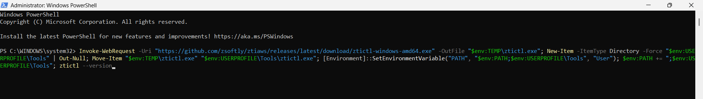
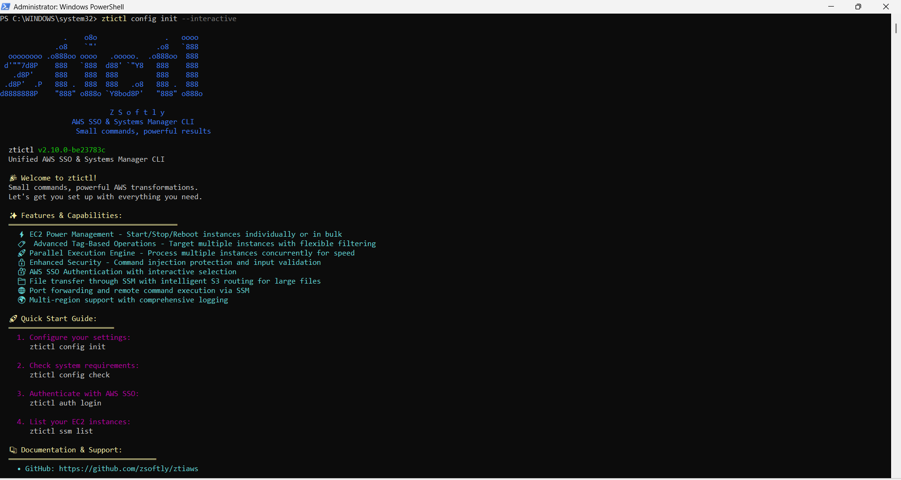
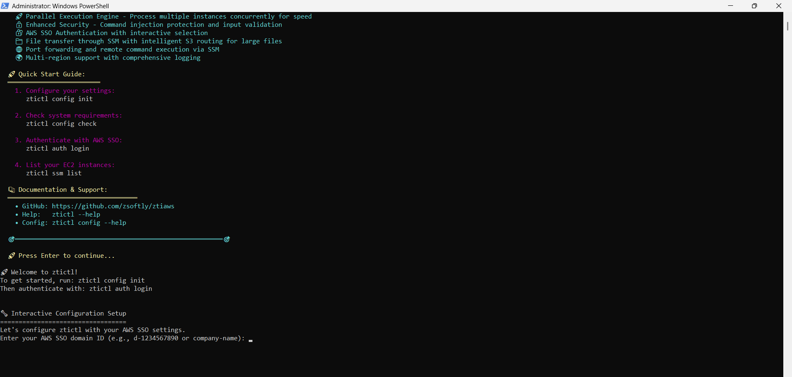
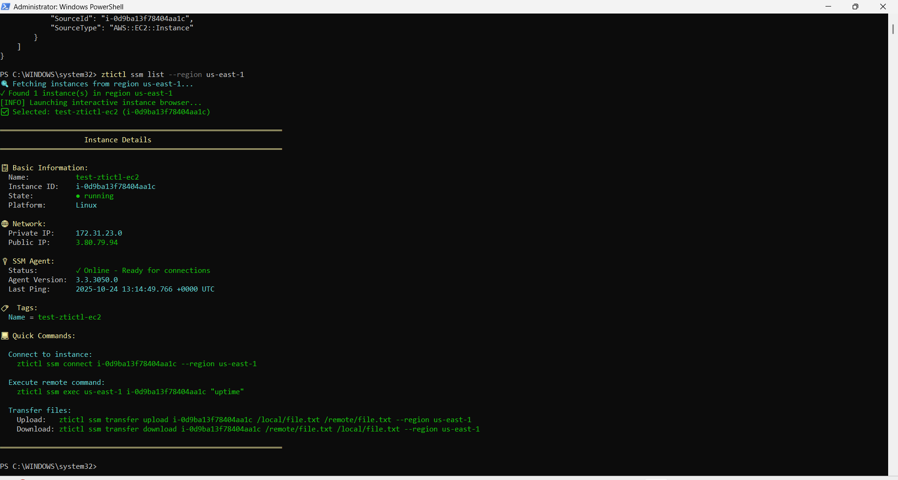
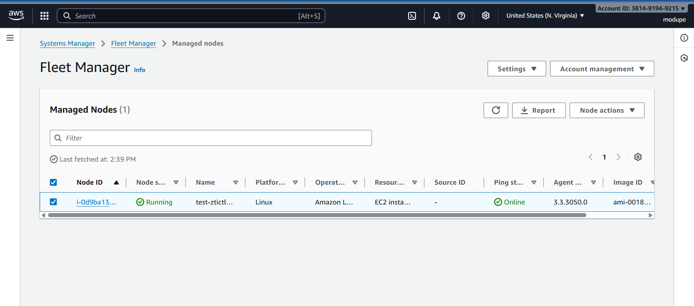
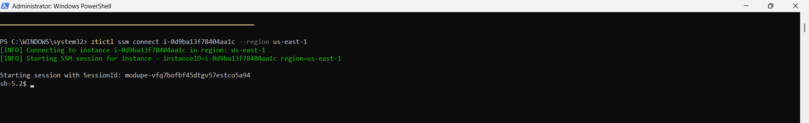
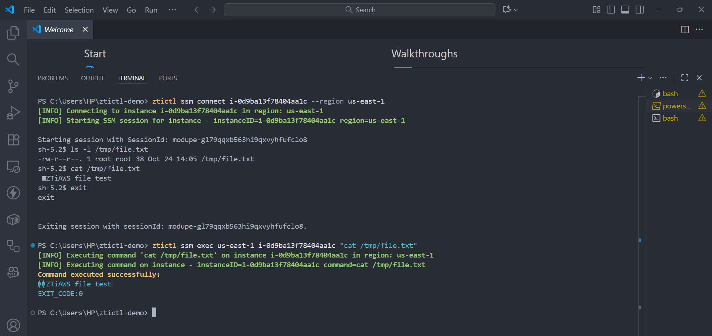
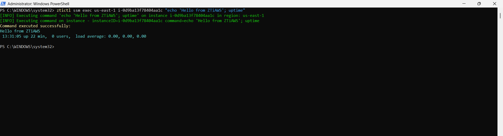
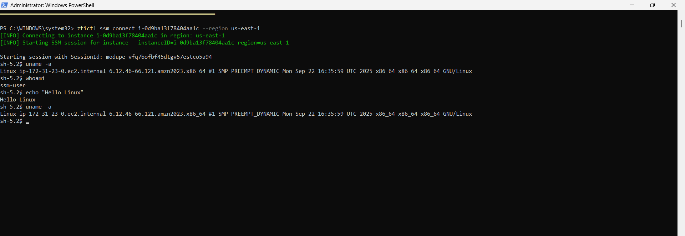
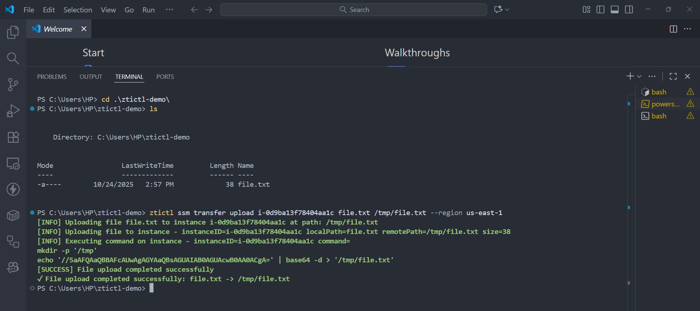

# ZTiAWS Product Demo — Installation, Authentication, and Use Cases

**Prepared by:** Modupe Ilesanmi 

**Product:** ZTiAWS (ZSoftly Tools for AWS)

**Duration:** ~45 minutes 

**Goal:** Introduce ZTiAWS to new users, demonstrate real-world use cases, and show why it simplifies AWS management.

---

## Overview

ZTiAWS (ZSoftly Tools for AWS) is a suite of open-source CLI tools that simplify AWS management through automation, smart defaults, and a modern user experience.

> “Life’s too short for long AWS commands.” — *ZSoftly Team*

This demo introduces **ZTiAWS end-to-end**, covering:
- Installation (Linux and Windows)
- Configuration & Authentication (AWS SSO)
- Practical use cases using the `ztictl` CLI tool
- Summary and benefits

---

## Demo Agenda

| Segment | Duration | Focus |
|----------|-----------|--------|
| 1. Introduction | 5 min | What ZTiAWS is and why it matters |
| 2. Installation | 10 min | Setup on Linux and Windows |
| 3. Authentication | 10 min | AWS SSO login and config check |
| 4. Use Cases | 20 min | Real-world operations and automation |
| 5. Wrap-Up | 5 min | Key benefits and adoption message |

---

## 1. Introduction

ZTiAWS was built to make AWS management faster, safer, and simpler.  
It reduces the friction of using the AWS CLI by abstracting complex commands into clear, human-friendly operations.


**Example:**
```bash
# Traditional AWS CLI
aws ssm start-session --target i-1234567890abcdef0

# With ZTiAWS
ztictl ssm connect i-1234567890abcdef0

## 🚀 Key Features

 🌍 **Cross-platform**: Native binaries for Linux, macOS, and Windows (AMD64/ARM64)
 🔍 **Interactive fuzzy finder**: Real-time instance selection with keyboard navigation
 🔒 **Secure AWS SSO authentication** with built-in caching
 ⚙️ **Smart operations**: OS detection, automatic command adaptation
 📦 **S3-backed file transfers** with lifecycle management
 🧠 **Tag-based automation** for multi-instance and multi-region control
 🛠️ **Professional logging** with thread-safe concurrency
 🧩 **Modern CLI** with flag-based syntax and validation


2. Installation & Setup

Linux / macOS
curl -L -o /tmp/ztictl \
"https://github.com/zsoftly/ztiaws/releases/latest/download/ztictl-$(uname -s | tr '[:upper:]' '[:lower:]')-$(uname -m | sed 's/x86_64/amd64/; s/aarch64/arm64/')" \
&& chmod +x /tmp/ztictl && sudo mv /tmp/ztictl /usr/local/bin/ztictl && ztictl --version

Windows (PowerShell)
Invoke-WebRequest -Uri "https://github.com/zsoftly/ztiaws/releases/latest/download/ztictl-windows-amd64.exe" -OutFile "$env:TEMP\ztictl.exe"
New-Item -ItemType Directory -Force "$env:USERPROFILE\Tools" | Out-Null
Move-Item "$env:TEMP\ztictl.exe" "$env:USERPROFILE\Tools\ztictl.exe"
[Environment]::SetEnvironmentVariable("PATH", "$env:PATH;$env:USERPROFILE\Tools", "User")
ztictl --version

💬 “Installation is one command across all platforms — no dependency hell, no setup pain.”


3. Configuration & Authentication
Step 1 — Initialize Configuration
ztictl config init --interactive
ztictl config check --fix

Step 2 — Authenticate via AWS SSO
ztictl auth login

✅ Automatically:

Checks required components (AWS CLI, SSM plugin)
Prompts for SSO login with interactive account/role selection
Stores temporary credentials securely

💬 “Unlike the AWS CLI, ZTiAWS provides a guided SSO flow that securely manages temporary credentials and IAM role selection.”

4. Use Cases — Demonstration Scenarios

🧩 Use Case 1: List and Connect to EC2 Instances
ztictl ssm list --region ca-central-1
ztictl ssm connect --region ca-central-1

Highlights:
Interactive fuzzy finder for instance selection
Auto-detects OS (Linux vs Windows)

Benefit:
Fast, secure access with zero SSH key management.


⚙️ Use Case 2: Execute Cross-Platform Commands
# Linux Instance
ztictl ssm exec ca-central-1 i-linux123 "uname -a"

# Windows Instance
ztictl ssm exec ca-central-1 i-windows456 "Get-ComputerInfo"

Benefit:
Runs OS-specific commands automatically using Bash or PowerShell — no manual detection needed.


🌎 Use Case 3: Multi-Region and Tag-Based Operations
ztictl ssm exec-tagged us-east-1 --tags Environment=prod,Role=web "df -h"
ztictl ssm exec-multi ca-central-1,us-east-1,eu-west-1 --tags "App=web" "uptime"

Benefit:
Execute parallel commands across multiple regions and tagged instances with a single command.


📦 Use Case 4: Smart File Transfers
# Upload to remote instance
ztictl ssm transfer upload i-linux123 ./config.txt /etc/app/config.txt

# Download logs
ztictl ssm transfer download i-windows456 C:\logs\sys.log ./sys.log

Benefit:
Automatic S3 routing for large files with secure lifecycle cleanup.


🔋 Use Case 5: Instance Power Management
ztictl ssm start-tagged --tags "AutoStart=true" --region euw1
ztictl ssm stop-tagged --tags "Environment=dev" --region cac1

Benefit:
Start or stop multiple EC2 instances by tag or environment from a single terminal command.


```


## 🧪 Demo Walkthrough (ZTiAWS Setup & Validation)

Below are the step-by-step screenshots showing installation, configuration, and usage.

---

### 1️⃣ Installing ZTiAWS CLI (ztictl)



### 2️⃣ Initialize Configuration



### 3️⃣ Configuration Verification



### 4️⃣ Confirm SSM Connection to EC2


### 5️⃣ List EC2 Instances



### 6️⃣ AWS Console — SSM Managed Instance



### 7️⃣ ZTiAWS Connect to EC2



### 8️⃣ Using Connect and Exec Commands



### 9️⃣ Executing Commands Remotely



### 🔟 Linux Commands Output



### 11️⃣ Creating Folder and File


### 12️⃣ Uploading Local File to EC2



```

5. Summary of Benefits
Feature	Traditional AWS CLI	With ZTiAWS
Authentication	Manual SSO setup	Guided one-command login
Instance Access	Long IDs, SSH	Interactive fuzzy finder
OS Detection	Manual scripts	Auto-detect and adapt
Multi-Region Ops	Loops & scripts	Single command
File Transfers	Manual S3 upload	Smart routing with S3
Power Control	Console or SDK	Tag-based automation


6. Conclusion

ZTiAWS is more than a utility — it’s a productivity framework for modern AWS operations.

Key Takeaways:

Cross-platform and developer-friendly
Secure SSO and IAM lifecycle management
Intelligent automation for SSM and EC2
Perfect for DevOps teams and managed environments

“ZTIAWS — Simplify AWS. Amplify Productivity.”

Repository: https://github.com/zsoftly/ztiaws

🧱 Recommended Next Steps
1. Clone the repository.
2. Follow this demo to install and test ZTiAWS locally.
3. Share feedback via the #ztiaws engineering channel.
4. (Optional) Contribute new regions or commands via PR.

End of Document
